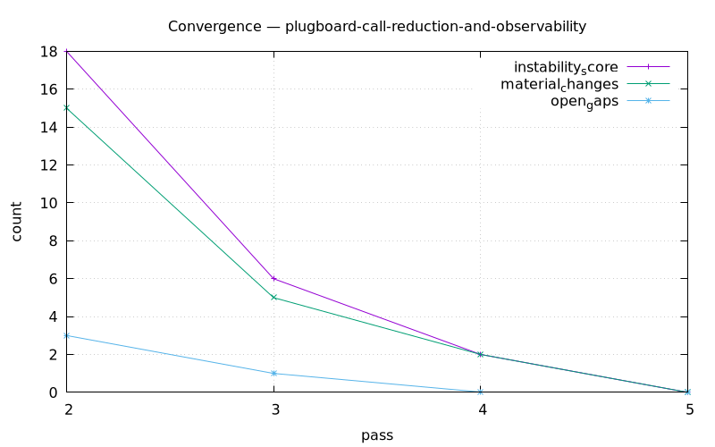

# Planning Report: Plugboard Call Reduction & Observability

**Date:** 2026-06-08 · **Mode:** auto-plan `--harden --max-passes 10` · **Domains:** backend, observability, devops, data-ml

## Execution Stats
- Sub-agents spawned: **13** (4 grillers, 4 hardening-pass agents [passes 2,3,5 dispatched; pass 4 applied inline], 4 convergence judges, + inline orchestration)
- Grilling iterations: 1 (4 parallel grillers, all branches resolved first round)
- Hardening passes: **5** (converged at pass 5; ceiling was 10)
- Questions auto-answered: ~40 across grillers
- Questions asked to user: **6** (2 batches: 3 scope questions + 3 architecture questions)
- Branches explored: 6
- Max depth: 1 (+ 4 hardening-discovered corrections)
- Conflicts detected & resolved: 2 (token-source for periodic log; metric-naming across processes)
- **Convergence: `converged` after 4 judged passes** (instability 18 → 6 → 2 → 0)

## Hardening Passes
| Pass | Material? | Gaps Filled | Bubbled Up | Verdict Rationale | Snapshot |
|------|-----------|-------------|------------|-------------------|----------|
| 2 | yes (15) | 4 | 0 | Caught 3 factual code-ref errors (score_urgency in `enqueue` not scheduler; entity-episode needs `record_entity` handler; memory binds `0.0.0.0`); added `enqueue_prescored` contract, pinned max_tokens formula | `snapshots/pass-1`* |
| 3 | yes (5) | 3 | 0 | Fixed all 3 pass-2 gaps (helper module ownership, §6 path-dependent criterion, plan T7 `record_entity`); judge found 1 new gap (`decide_from_score` signature drift) | `snapshots/pass-2`* |
| 4 | yes (2) | 2 | 0 | Reconciled `decide_from_score` signature + wired dead `PipelineConfig` thresholds; judge: **zero open gaps** | `snapshots/pass-3` |
| 5 | **no (0)** | 0 | 0 | Fresh-context cross-check vs real code — every decision maps to a task, interfaces/metrics consistent, code facts verified, no UNRESOLVED. **CONVERGED** | `snapshots/pass-4` |

\* pass-1/pass-2 snapshots pruned by last-2 retention; pass-3 and pass-4 retained.



Instability score (material + gaps + pending + unresolved) per pass: **18 → 6 → 2 → 0**.

## Decision Log (key)
| # | Decision | Source |
|---|----------|--------|
| d001 | auto_drop recording config-gated (`pipeline.record_drop_decisions=False`); `auto_include` unchanged; also wire `triage_expiry_days` | user + griller |
| d002 | Batching = unit-of-work (`score_relevance_many` per raw item; `score_urgency_many` per poll via `enqueue_prescored`), not time-window; JSON-indexed multi-item prompt; per-item fallback; don't batch extract/card/interpret | user + ADR 0048 |
| d003 | `score_urgency_many` raises `max_tokens=min(4096, 40·n+100)` (the 100-cap was a hard blocker) | griller |
| d004 | Call-site shim `_plugboard.py` wrapping `messages.create`; `PlugboardCallRecord` → injected sink; providers don't import metrics; coexists with method-view decorator | ADR 0049 |
| d005 | `plugboard_*{client,model}` family (calls/call_seconds/tokens{direction}/errors/items); existing `llm_*{method}` untouched | ADR 0049/0050 |
| d006 | Memory: `InstrumentedAnthropicClient` subclass in `create_llm_client` (covers OSS+Meta); tokens best-effort; `client="memory"`; `type=entity` via `record_entity` handler | ADR 0050 |
| d007 | Periodic `llm_usage_summary` from in-process aggregator (`drain()`), skip empty; both processes | griller |
| d008 | `/metrics` unauthenticated both services; main app loopback, memory `0.0.0.0` | ADR 0051 |
| d009 | `prometheus.yml` + prometheus/grafana in foundational compose (`network_mode: host`); dashboards deferred | griller |
| d010 | `metrics.enabled` gates emission; `summary_log` gates the summary task; `DebugConfig.llm_token_usage` gates verbose per-call logging | griller |

## Branch Tree
```
Plugboard call reduction & observability (6 branches)
├── b001 auto_drop config gate            [user input]
├── b002 unit-of-work batching            [user input]
│   ├── (h1) score_urgency in enqueue + _route_poll_results path   [discovered: pass 2]
│   └── (h4) decide_from_score in filter.py + wire PipelineConfig  [discovered: pass 3-4]
├── b003 main-app LLM instrumentation      [user input]
│   └── (h3) memory binds 0.0.0.0 not loopback                     [discovered: pass 2]
├── b004 memory-service metrics + Graphiti [user input]
│   └── (h2) type=entity needs record_entity handler              [discovered: pass 2-3]
├── b005 periodic llm_usage_summary        [auto-answered]
└── b006 ops (prometheus/grafana/compose)  [auto-answered]
```
(see `2026-06-08-plugboard-call-reduction-and-observability-tree.dot` / `.png`)

## Preference Updates
None saved this run (existing memories already covered YAML-source-of-truth, structlog, foundational/Meta split, do-it-right).

## Artifacts Produced
- Spec: `docs/auto-plan/specs/2026-06-08-plugboard-call-reduction-and-observability-design.md`
- Plan: `docs/auto-plan/plans/2026-06-08-plugboard-call-reduction-and-observability.md` (8 TDD tasks)
- ADRs: `docs/adr/0048` (unit-of-work batching), `0049` (two-layer instrumentation + sink injection), `0050` (memory Graphiti client instrumentation), `0051` (unauthenticated `/metrics`)
- CONTEXT.md: appended "Observability & call-reduction (plugboard)" glossary section
- Reports: this report, `-state.json`, `-convergence.csv`, `-convergence.png`, `-tree.dot`, `-tree.png`, `snapshots/pass-3..4/`

## Out-of-scope (flagged for the user)
- Read-only config mount (`config.example.yml:/app/config.yml:ro`) vs hot-reload write-back in the Meta container — pre-existing conflict, needs a separate decision.
- Curated Grafana dashboards (datasource provisioned; dashboards deferred).
- Anthropic Message Batches async API (rejected this iteration).

## Latent bugs surfaced (folded into the plan as in-scope cleanups)
- `triage_expiry_days` never wired from `config.triage.expiry_days` (silently defaults to 7).
- `PipelineConfig.{include,drop,confidence}_threshold` never wired into `score_and_decide` (dead config; now threaded via `PipelineEngine.__init__`).
