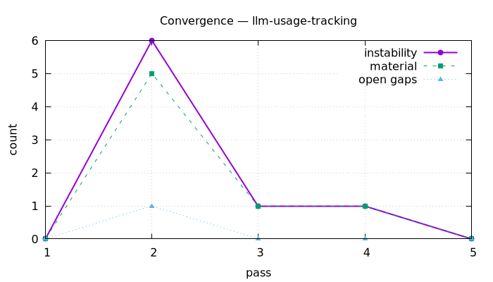

# Planning Report: LLM Usage Tracking

**Date:** 2026-06-17 · **Mode:** `--harden` (max-passes 20) · **Status:** CONVERGED after 5 passes

## Execution Stats

- Sub-agents spawned: 16 (3 initial researchers + 1 follow-up researcher + 5 grillers + 3 hardening pass agents + 3 convergence judges + 1 final confirm pass)
- Grilling iterations: 1 (5 parallel grillers) + 1 follow-up research round
- Hardening passes: 5 (1 baseline + 3 material + 1 clean confirm)
- Questions auto-answered: most design decisions (from grilling + verified codebase facts)
- Questions asked to user: 5 (4 in Phase 0.5 + 1 memory-scope bubble-up)
- Branches explored: 5 (grouped from 8 skeleton branches)
- Conflicts detected: 1 cross-branch (`running` status) + 1 settled-decision tension (memory subservice fidelity, escalated)
- Domains: backend, observability, data, frontend, api-design

## Decision Log

| # | Question | Answer | Source |
|---|----------|--------|--------|
| 1 | Capture fidelity | Full (bodies + context) via contextvars + extended `record_plugboard_call` | user / ADR 0056 |
| 2 | Body privacy | Store raw (single-user) | user |
| 3 | Retention | Configurable, default 28d, daily sweep + optional row cap | user / research |
| 4 | Scope | main_llm (extract/filter/triage/aggregate) + queue_scorer (scoring) + memory (memory); enrichers/briefing don't call LLMs | user / research |
| 5 | Memory subservice | Full fidelity by wrapping Graphiti; writes to workbench-owned table via configured DSN | user / ADR 0059 |
| 6 | Row granularity | One row per call; subcalls nested; single = one subcall | grilling |
| 7 | `running` status | Never persisted; completed-only tail | ADR 0061 |
| 8 | Provenance mechanism | contextvars `LLMCallContext` | ADR 0056 |
| 9 | Sync→async write | Bounded queue + writer task; drop on full/error | ADR 0057 |
| 10 | Batch tokens | Proportional split (`tokens_estimated`); fallback → `is_fallback` rows | grilling / research |
| 11 | Stat-card source | SQL over `llm_calls`, 24h rolling UTC | ADR 0058 |
| 12 | Transport | TanStack polling, no SSE | ADR 0060 |
| 13 | Detail payload | Lazy on click; list rows summary-only | grilling |
| 14 | UI stages | Add `extract`, `scoring`, `memory` to `LLM_STAGE_TONE` | research |
| 15 | Gating | `llm_tracking.enabled` (default true), independent of `metrics.enabled`; sink wiring ungated to `metrics.enabled OR llm_tracking.enabled` | grilling / ADR 0057 |
| 16 | Telemetry relationship | Additive two-sink model | ADR 0058 |
| 17 | API typing | Bare dicts + hand-written TS (no `response_model`) | house convention |

## Hardening Passes

Convergence: **converged** after 5 passes.

| Pass | Material? | Gaps filled | Verdict rationale | Snapshot |
|------|-----------|-------------|-------------------|----------|
| 1 | baseline | — | Baseline artifacts (spec, 6 ADRs, plan) | — |
| 2 | yes (5) | sink ungating, temperature contract, /{id} 404, CONTEXT glossary | Caught the load-bearing `metrics.enabled` gating bug (would capture zero rows); 1 open gap | `snapshots/pass-2/` |
| 3 | yes (1) | spec↔plan temperature/{id} consistency | Closed the open gap + added a contract test | `snapshots/pass-3/` |
| 4 | yes (1) | ADR citation correctness | Fixed dangling/incorrect ADR references | `snapshots/pass-4/` |
| 5 | no (0) | — | Zero edits; all five checks pass → CONVERGED | — |



Instability score by pass: `0 → 6 → 1 → 1 → 0`  ▁█▂▂▁  (CSV: `2026-06-17-llm-usage-tracking-convergence.csv`)

## Branch Tree

```
LLM Usage Tracking (5 branches)
├── Data model + persistence + migration 013 + retention   [auto-answered]
│   ├── retention 28d                                       [user]
│   └── running not persisted                               [discovered]
├── Capture mechanism (contextvars + sink→writer)           [auto-answered]
│   ├── full fidelity                                       [user]
│   └── sink ungated from metrics.enabled                   [hardening pass 2]
├── API + UI + transport                                    [auto-answered]
│   ├── add extract/scoring/memory stages                   [discovered]
│   └── store raw                                            [user]
├── Metrics + telemetry reconciliation                      [auto-answered]
└── Cross-service capture (memory + enrichers)              [user input]
    └── memory: wrap Graphiti                               [user]
```

(See `2026-06-17-llm-usage-tracking-tree.dot` / `.png` for the rendered graph.)

## Preference Updates

- `feedback_max_fidelity_preference` — user consistently chooses the most complete option over lower-effort/simpler ones (saved to memory).

## Artifacts Produced

- Spec: `docs/auto-plan/specs/2026-06-17-llm-usage-tracking-design.md`
- ADRs: `docs/adr/0056`…`0061` (provenance via contextvars; sync→async writer bridge; `llm_calls` source-of-truth; cross-service memory write; polling-not-SSE; running-not-persisted)
- Plan: `docs/auto-plan/plans/2026-06-17-llm-usage-tracking.md` (12 TDD tasks across data → capture → wiring → API → UI → retention → memory)
- Glossary: `CONTEXT.md` (7 new terms)
- State: `docs/auto-plan/reports/2026-06-17-llm-usage-tracking-state.json`
- Convergence: `…-convergence.csv` / `…-convergence.png`
- Tree: `…-tree.dot` / `…-tree.png`

## Notes / adaptations

- Pass 1 (baseline) artifacts were authored directly by the orchestrator (full context held from grilling) rather than via separate Writer/Reviewer round-trips; the rigor is supplied by the Phase 5 fresh-context hardening passes + independent convergence judges, which is where the load-bearing `metrics.enabled` gating bug was caught.
- The biggest design risk surfaced: the memory subservice is a separate process on a separate DB with Graphiti-owned calls (no native token/body capture). The user chose full fidelity (wrap Graphiti), captured as ADR 0059 with its brittleness called out.
