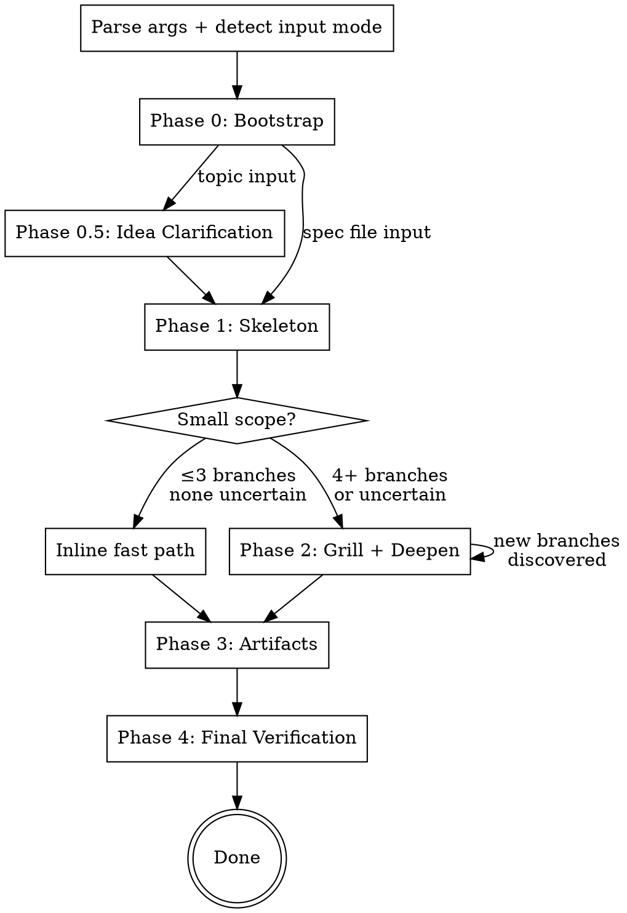

# Deep Plan Skill Implementation Plan

> **For agentic workers:** REQUIRED SUB-SKILL: Use superpowers:subagent-driven-development (recommended) or superpowers:executing-plans to implement this plan task-by-task. Steps use checkbox (`- [ ]`) syntax for tracking.

**Goal:** Create the `deep-plan` skill — an autonomous planning agent that wraps grill-with-docs with contextual auto-answering, iterative deepening, and sub-agent orchestration to produce fully-grilled specs, ADRs, and implementation plans.

**Architecture:** A Claude Code skill (`~/.claude/skills/deep-plan/SKILL.md`) with 7 supporting protocol/template files. The main SKILL.md contains orchestrator instructions (phases 0–4, sub-agent dispatch, state management, preference store). Supporting files are read on-demand when dispatching specific sub-agent types. No code — all markdown.

**Tech Stack:** Markdown (skill definitions), JSON (state file format), Graphviz DOT (branch tree visualization)

**Test commands:**
- Invoke: `/deep-plan <topic>` in Claude Code
- Verify: check that the skill produces the expected artifacts in `docs/deep-plan/`
- Check sub-agent dispatch: observe `[deep-plan]` progress lines in output

---

## Task 1: GRILLER-PROTOCOL.md — Distilled Grill-with-Docs Protocol

**Files:**
- Create: `~/.claude/skills/deep-plan/GRILLER-PROTOCOL.md`

This is the first file because Grillers are the core sub-agent type. Every other protocol builds on or references the grilling approach.

- [ ] **Step 1: Create the distilled protocol**

Create `~/.claude/skills/deep-plan/GRILLER-PROTOCOL.md`:

```markdown
# Griller Protocol

Distilled from mp-grill-with-docs. This is your grilling playbook — follow it exactly.

## Your Job

Walk down every branch of the design for your assigned topic. For each decision point, either auto-answer (using the user model brief) or flag as unresolved. You are grilling YOURSELF — there is no human in this loop.

## The Protocol

1. **Challenge against the glossary.** Check every term against the CONTEXT.md provided. Does each term mean what the spec thinks it means? If a term is used inconsistently or vaguely, flag it in your CONTEXT.md Updates section.

2. **Sharpen fuzzy language.** Words like "handle," "process," "manage," "appropriate" are red flags. Replace with precise verbs. Propose canonical terms for vague concepts.

3. **Cross-reference with code.** When the spec describes behavior, check the codebase context provided. Does the code already do this? Does it contradict the spec? Surface any mismatches.

4. **Walk concrete scenarios.** For each decision, imagine a specific real-world case that exercises it. Does the design hold? What breaks at the edges?

5. **Probe edge cases.** What happens when input is empty? When the system is overloaded? When two things happen at once? When the config is missing?

6. **Auto-answer using the user model.** For each question:
   - Check the user model brief for a matching preference or constraint
   - If high confidence (direct match in memory/ADR/codebase): answer and move on
   - If medium confidence (consistent with principles but no direct match): answer with your reasoning
   - If low confidence (genuinely novel trade-off): flag as unresolved with your recommendation

7. **Identify ADR candidates.** Only when ALL THREE are true:
   - Hard to reverse (changing later would be expensive or disruptive)
   - Surprising without context (a future reader would ask "why?")
   - Result of a real trade-off (genuine alternatives with different pros/cons)

## What NOT To Do

- Don't ask the user questions — you're a sub-agent, not interactive
- Don't re-decide things marked as settled constraints
- Don't explore the full codebase — use only the context provided
- Don't write long narratives — be concise and structured
```

- [ ] **Step 2: Verify the file is readable**

```bash
cat ~/.claude/skills/deep-plan/GRILLER-PROTOCOL.md | head -5
```
Expected: Shows `# Griller Protocol` header.

- [ ] **Step 3: Commit**

```bash
cd ~/.claude/skills/deep-plan && git init 2>/dev/null; git add GRILLER-PROTOCOL.md && git commit -m "feat(deep-plan): add distilled griller protocol"
```

---

## Task 2: GRILLER-RESPONSE-TEMPLATE.md — Structured Response Format

**Files:**
- Create: `~/.claude/skills/deep-plan/GRILLER-RESPONSE-TEMPLATE.md`

- [ ] **Step 1: Create the response template**

Create `~/.claude/skills/deep-plan/GRILLER-RESPONSE-TEMPLATE.md`:

```markdown
# Griller Response Template

Structure your response with these exact headers. The orchestrator reads these sections to collect your results. Missing sections are treated as empty.

---

### Decisions

For each question you answered:

- [Question]: [Answer] | Confidence: high/medium/low | Source: [memory/ADR/codebase/principle/best-judgment]

Example:
- Canonical ID format: UUID4 | Confidence: high | Source: ADR 0009 + user preference for "do it now, avoid future migrations"
- Error retry strategy: 3x with exponential backoff | Confidence: medium | Source: consistent with existing adapter error isolation pattern in codebase

### Unresolved

For each question you couldn't answer confidently:

- [Question]: Recommended: [your best answer] | Confidence: low | Why uncertain: [what's missing — no signal in user model, genuinely novel trade-off, conflicting signals]

Example:
- Calendar event dedup strategy: Recommended: hash meaningful fields (title, time, location) | Confidence: low | Why uncertain: two valid approaches (hash vs etag), no user preference signal, both have different failure modes

### ADR Candidates

Only include if ALL THREE criteria are met: hard to reverse + surprising without context + result of a real trade-off.

- Title: [short title] | Context: [1 sentence] | Decision: [what was decided] | Alternatives: [what was rejected and why]

### CONTEXT.md Updates

New terms or sharpened definitions:

- **Term**: definition. _Avoid_: [synonyms to avoid]

### New Branches

Sub-topics discovered during grilling that need their own deep-dive:

- [Topic] — [why this needs separate exploration, what questions it raises]
```

- [ ] **Step 2: Verify the file**

```bash
cat ~/.claude/skills/deep-plan/GRILLER-RESPONSE-TEMPLATE.md | head -5
```
Expected: Shows `# Griller Response Template` header.

- [ ] **Step 3: Commit**

```bash
cd ~/.claude/skills/deep-plan && git add GRILLER-RESPONSE-TEMPLATE.md && git commit -m "feat(deep-plan): add griller response template"
```

---

## Task 3: WRITER-SPEC-PROTOCOL.md — Spec Document Structure

**Files:**
- Create: `~/.claude/skills/deep-plan/WRITER-SPEC-PROTOCOL.md`

- [ ] **Step 1: Create the spec protocol**

Create `~/.claude/skills/deep-plan/WRITER-SPEC-PROTOCOL.md`:

```markdown
# Writer Spec Protocol

When writing a design spec, follow this structure. Every section is required unless marked optional. Fill each section from the resolved decisions provided by the orchestrator.

---

## Document Structure

```
# [Feature Name] — Design Spec

## Context
What exists today, what's missing, why this work is needed.
2-3 sentences grounding the reader.

## Goals
Numbered list of objectives. Each goal is one sentence, starts with a bold keyword.
Example:
1. **Autonomous planning** — the skill runs until...
2. **Contextual auto-answering** — uses domain-tagged...

## Architecture
Diagram (ASCII art or description) showing how components fit together.
2-3 sentences explaining the flow.

## [Design Sections]
One section per major component or subsystem. This is the bulk of the spec.
Each section covers: what it does, how it works, config/schema if applicable.
Use code blocks for schemas, configs, and interface definitions.
Use tables for mappings and field descriptions.

## File Changes
Tables of new and modified files, grouped by component:
| File | Description |
|------|-------------|

## Verification
Numbered checklist. "This is done when..."
Each item is independently testable.

## Resolved Questions
From grilling sessions. Format:
N. **[Topic]:** → [Decision]. [Brief rationale if non-obvious.]

## Out of Scope
Bulleted list of what this explicitly does NOT include.
```

## Rules

- Use terms from CONTEXT.md exactly — don't introduce synonyms
- Every design decision from the grilling sessions must appear in a design section
- No placeholders (TBD, TODO, "to be determined")
- No fuzzy language ("handle appropriately", "as needed")
- Code blocks for anything that has a concrete shape (schemas, configs, interfaces)
- Keep sections focused — if a section exceeds ~200 lines, it probably needs splitting
```

- [ ] **Step 2: Verify the file**

```bash
cat ~/.claude/skills/deep-plan/WRITER-SPEC-PROTOCOL.md | head -5
```
Expected: Shows `# Writer Spec Protocol` header.

- [ ] **Step 3: Commit**

```bash
cd ~/.claude/skills/deep-plan && git add WRITER-SPEC-PROTOCOL.md && git commit -m "feat(deep-plan): add writer spec protocol"
```

---

## Task 4: WRITER-PLAN-PROTOCOL.md — Distilled Writing-Plans Format

**Files:**
- Create: `~/.claude/skills/deep-plan/WRITER-PLAN-PROTOCOL.md`

- [ ] **Step 1: Create the plan protocol**

Create `~/.claude/skills/deep-plan/WRITER-PLAN-PROTOCOL.md`:

```markdown
# Writer Plan Protocol

Distilled from the writing-plans skill. Follow this format exactly when producing an implementation plan.

## Plan Header

Every plan starts with:

```
# [Feature Name] Implementation Plan

> **For agentic workers:** REQUIRED SUB-SKILL: Use superpowers:subagent-driven-development (recommended) or superpowers:executing-plans to implement this plan task-by-task.

**Goal:** [One sentence]

**Architecture:** [2-3 sentences]

**Tech Stack:** [Key technologies]

**Test commands:**
- [How to run tests]
- [How to run a single test]

---
```

## File Structure

Before tasks, map out which files will be created or modified. Each file gets one clear responsibility.

## Task Format

```
### Task N: [Component Name]

**Files:**
- Create: `exact/path/to/file.ext`
- Modify: `exact/path/to/existing.ext`
- Test: `tests/exact/path/to/test.ext`

- [ ] **Step 1: Write the failing test**
[complete test code]

- [ ] **Step 2: Run test to verify it fails**
Run: [exact command]
Expected: [exact failure message]

- [ ] **Step 3: Write minimal implementation**
[complete implementation code]

- [ ] **Step 4: Run test to verify it passes**
Run: [exact command]
Expected: PASS

- [ ] **Step 5: Commit**
[exact commit command with message]
```

## Rules

- **TDD always** — write the test first, watch it fail, then implement
- **Bite-sized steps** — each step is one action (2-5 minutes)
- **No placeholders** — every step has complete code, exact commands, expected output
- **No "similar to Task N"** — repeat the code; the engineer may read tasks out of order
- **Exact file paths** — never use relative or ambiguous paths
- **Frequent commits** — commit after each task (not each step)
- **DRY, YAGNI** — don't add abstractions or features beyond what the spec requires
```

- [ ] **Step 2: Verify the file**

```bash
cat ~/.claude/skills/deep-plan/WRITER-PLAN-PROTOCOL.md | head -5
```
Expected: Shows `# Writer Plan Protocol` header.

- [ ] **Step 3: Commit**

```bash
cd ~/.claude/skills/deep-plan && git add WRITER-PLAN-PROTOCOL.md && git commit -m "feat(deep-plan): add writer plan protocol"
```

---

## Task 5: Review Checklists — SPEC, PLAN, FINAL

**Files:**
- Create: `~/.claude/skills/deep-plan/SPEC-REVIEW-CHECKLIST.md`
- Create: `~/.claude/skills/deep-plan/PLAN-REVIEW-CHECKLIST.md`
- Create: `~/.claude/skills/deep-plan/FINAL-REVIEW-CHECKLIST.md`

- [ ] **Step 1: Create SPEC-REVIEW-CHECKLIST.md**

Create `~/.claude/skills/deep-plan/SPEC-REVIEW-CHECKLIST.md`:

```markdown
# Spec Review Checklist

You are reviewing a design spec produced by a Writer sub-agent. Check each item below. Report any failures with the specific text that violates the rule.

## Checklist

1. **Decision coverage.** Every resolved decision from the grilling sessions is reflected in the spec. Cross-reference the decision log (provided by the orchestrator). List any decisions not found in the spec.

2. **No internal contradictions.** Read each section and check: does any statement contradict another section? Pay special attention to schemas, interfaces, and behavioral descriptions that appear in multiple places.

3. **No fuzzy language.** Search for: "handle," "process," "manage," "appropriate," "as needed," "etc.," "and so on," "relevant," "properly." Each is a red flag. Propose a precise replacement.

4. **Scope match.** Does the spec cover exactly what was agreed during grilling — no more, no less? Flag any scope creep (features not discussed) or missing pieces (discussed but not in spec).

5. **CONTEXT.md alignment.** Every term used in the spec must match CONTEXT.md exactly. Flag any synonyms, variant spellings, or terms used inconsistently.

6. **No placeholders.** Search for: "TBD," "TODO," "to be determined," "fill in," "implement later," "[...]," "placeholder." Each is a failure.

## Response Format

```
### Result: PASS or FAIL

### Issues (if FAIL)
1. [checklist item number]: [specific text that fails] → [what's wrong] → [suggested fix]
2. ...
```
```

- [ ] **Step 2: Create PLAN-REVIEW-CHECKLIST.md**

Create `~/.claude/skills/deep-plan/PLAN-REVIEW-CHECKLIST.md`:

```markdown
# Plan Review Checklist

You are reviewing an implementation plan produced by a Writer sub-agent. Check each item below against the design spec (provided by the orchestrator).

## Checklist

1. **Spec coverage.** Every requirement in the spec maps to at least one task in the plan. Skim each spec section — can you point to the task that implements it? List any gaps.

2. **No placeholders.** Search for: "TBD," "TODO," "similar to Task N," "add appropriate," "handle edge cases," "fill in details," "implement later." Each is a failure. Every step must have complete code or exact commands.

3. **Type consistency.** Do types, method signatures, function names, and property names match across all tasks? A function called `save_item()` in Task 3 but `store_item()` in Task 7 is a bug. Check every cross-task reference.

4. **Dependency ordering.** Tasks that depend on earlier tasks must come after them. Check: does any task reference a type, function, or file that isn't created until a later task?

5. **Interface consistency.** Code in later tasks that calls functions defined in earlier tasks must match the exact signature (parameter names, types, return type). Check every call site.

6. **Runnable commands.** Every "Run:" line must be an exact, copy-pasteable command. Every "Expected:" line must describe the exact output or error. No vague expectations like "should work" or "tests pass."

## Response Format

```
### Result: PASS or FAIL

### Issues (if FAIL)
1. [checklist item number]: [specific text that fails] → [what's wrong] → [suggested fix]
2. ...
```
```

- [ ] **Step 3: Create FINAL-REVIEW-CHECKLIST.md**

Create `~/.claude/skills/deep-plan/FINAL-REVIEW-CHECKLIST.md`:

```markdown
# Final Cross-Cutting Review Checklist

You are doing a final review of ALL artifacts produced by deep-plan: spec, ADRs, implementation plan, and CONTEXT.md updates. Check for cross-artifact consistency.

## Checklist

1. **Spec ↔ plan consistency.** Every spec requirement maps to a plan task. Every plan task traces back to a spec requirement. List orphaned requirements and orphaned tasks.

2. **CONTEXT.md completeness.** Every new term introduced in the spec or plan is defined in CONTEXT.md. No term is used before it's defined.

3. **ADR consistency.** If ADRs were produced, do they contradict anything in the spec? Does the spec reference decisions documented in ADRs correctly?

4. **No unresolved markers.** Search all artifacts for: "UNRESOLVED," "TBD," "TODO," "to be determined." If found, this is expected only when --max-iterations was hit. Otherwise it's a failure.

5. **Term consistency across artifacts.** The same concept must use the same term everywhere. If the spec calls it "entity ref" but the plan calls it "entity reference," that's a bug.

6. **No dangling references.** No artifact references a concept, type, function, or file that isn't defined in another artifact. Every cross-reference must resolve.

## Response Format

```
### Result: PASS or FAIL

### Issues (if FAIL)
1. [checklist item number]: [artifact] [specific text] → [what's wrong] → [suggested fix]
2. ...
```
```

- [ ] **Step 4: Verify all three files**

```bash
head -1 ~/.claude/skills/deep-plan/SPEC-REVIEW-CHECKLIST.md
head -1 ~/.claude/skills/deep-plan/PLAN-REVIEW-CHECKLIST.md
head -1 ~/.claude/skills/deep-plan/FINAL-REVIEW-CHECKLIST.md
```
Expected: Each shows its respective `# ... Checklist` header.

- [ ] **Step 5: Commit**

```bash
cd ~/.claude/skills/deep-plan && git add SPEC-REVIEW-CHECKLIST.md PLAN-REVIEW-CHECKLIST.md FINAL-REVIEW-CHECKLIST.md && git commit -m "feat(deep-plan): add spec, plan, and final review checklists"
```

---

## Task 6: SKILL.md — Main Skill Definition (Part 1: Frontmatter + Phases 0–1)

**Files:**
- Create: `~/.claude/skills/deep-plan/SKILL.md`

The SKILL.md is the largest file (~400 lines). Split into two tasks for manageability: Part 1 covers frontmatter, overview, configuration, and Phases 0–1. Part 2 covers Phases 2–4, sub-agent dispatch, state management, and observability.

- [ ] **Step 1: Create SKILL.md with frontmatter, overview, config, and Phases 0–1**

Create `~/.claude/skills/deep-plan/SKILL.md`:

```markdown
---
name: deep-plan
description: Use when planning a multi-step feature or grilling an existing spec. Autonomous planning agent that wraps grill-with-docs with contextual auto-answering, iterative deepening, and sub-agent orchestration. Produces fully-grilled specs, ADRs, and implementation plans.
---

# Deep Plan

Autonomous planning skill. Builds a contextual model of the user's preferences, auto-answers grilling questions where confident, prompts only when genuinely uncertain, and produces fully-grilled design artifacts.

## Overview



## Configuration

**Invocation:** `/deep-plan <topic or spec-path> [--flags]`

| Flag | Default | Description |
|------|---------|-------------|
| `--max-iterations` | `5` | Maximum grill-deepen cycles |
| `--max-depth` | `3` | Maximum branch nesting levels |
| `--confidence-threshold` | `medium` | `low` (fully autonomous), `medium`, `high`, `paranoid` (ask everything) |
| `--domains` | auto | Override domain detection (e.g., `--domains backend,infra`) |
| `--skip-plan` | off | Stop after spec + ADRs |
| `--plan-only` | off | Skip grilling, produce plan from existing spec. Requires spec file input. |
| `--auto-commit` | off | Commit artifacts without asking |
| `--dry-run` | off | Show skeleton + branches only |
| `--resume` | off | Continue interrupted session from state file |
| `--redo` | — | Change a decision (e.g., `--redo "use SQLite instead of PostgreSQL"`) |

**Phase matrix:**

| Mode | Phases | Output |
|------|--------|--------|
| Default | 0 → 0.5 → 1 → 2 → 3 → 4 | CONTEXT.md, spec, ADRs, plan |
| `--skip-plan` | 0 → 0.5 → 1 → 2 → 3 → 4 | CONTEXT.md, spec, ADRs |
| `--plan-only` | 0 → 3 → 4 | plan |
| `--dry-run` | 0 → 0.5 → 1 | nothing (shows skeleton) |
| `--resume` | load state → continue | remaining artifacts |
| `--redo` | load state → 2 → 3 → 4 | updated artifacts |

## Input Mode Detection

- If args resolve to an existing `.md` file on disk → **spec file input** (skip Phase 0.5, use as skeleton)
- Otherwise → **topic string input** (full flow including Phase 0.5)

**File collision handling:** Before writing artifacts, check for existing files:
- State file exists for same topic → ask "resume or start fresh?"
- Completed artifacts exist, no state file → ask "overwrite or create -v2?"
- Nothing exists → proceed

**`--plan-only` with UNRESOLVED markers:** If the spec contains `UNRESOLVED:` markers, list them and offer: (a) plan with BLOCKED tasks, (b) resolve first, (c) abort.

## Phase 0: Bootstrap

1. Read all preference sources:
   - Claude Code memory files (`~/.claude/projects/.../memory/`)
   - CONTEXT.md, ADRs in `docs/adr/`
   - CLAUDE.md
   - Workbench APIs: `GET /api/memory/facts` (best-effort, skip if unavailable)

2. Detect domain(s) from the topic. Domain vocabulary is open: `backend`, `frontend`, `infrastructure`, `data-ml`, `devops`, `api-design`, `observability`, etc. Show detected domains in output. Override with `--domains` flag.

3. Load domain-tagged preferences. If a domain has no stored preferences, ask 2-3 calibration questions (batched), save answers as domain-tagged feedback memories.

4. If invoked mid-conversation, scan the **last 10 messages** for context relevant to the planning topic. Ignore unrelated messages.

5. Compile the **user model brief** (~1000 tokens):

```
## User Model Brief

### Base Preferences
- [3-5 bullets from base feedback memories]

### Domain Preferences: {domain}
- [2-3 bullets per detected domain]

### Active Constraints
- [from CLAUDE.md and relevant ADRs]

### Correction Patterns
- [things the user has corrected in past sessions]

### Session Directives
- [from explicit args and conversation context]
```

**Output:** `[deep-plan] Phase 0: loaded N memories, N ADRs, detected domains: x, y`

## Phase 0.5: Idea Clarification (topic input only)

**Skipped when:** input is a spec file, or `--plan-only` is set.

**Confidence override:** Always `very-high` regardless of `--confidence-threshold`. Only auto-answer when memory/ADR/CLAUDE.md explicitly covers the question. Everything else gets asked.

1. Scan last 10 messages for context already discussed
2. Identify what's unclear: purpose, constraints, success criteria, scope boundaries, trade-offs
3. Auto-answer from user model (only `very-high` confidence matches)
4. Ask remaining questions **one at a time** until confident
5. If the design space is open, propose 2-3 architectural approaches with trade-offs and recommendation
6. **Exit condition:** you can write a one-paragraph summary of what's being built and why. Confirm with the user.

**Scope decomposition:** If the topic describes 4+ independent subsystems, suggest decomposition with natural seams. Plan one sub-project at a time. User re-invokes for the rest.

**Output:** `[deep-plan] Phase 0.5: idea clarification — N questions answered, N asked`
```

- [ ] **Step 2: Verify the file**

```bash
head -3 ~/.claude/skills/deep-plan/SKILL.md
```
Expected: Shows the YAML frontmatter opening `---`.

- [ ] **Step 3: Commit**

```bash
cd ~/.claude/skills/deep-plan && git add SKILL.md && git commit -m "feat(deep-plan): SKILL.md part 1 — frontmatter, config, phases 0-0.5"
```

---

## Task 7: SKILL.md — Part 2: Phases 1–4, Sub-Agent Dispatch, State Management

**Files:**
- Modify: `~/.claude/skills/deep-plan/SKILL.md`

- [ ] **Step 1: Append Phase 1 through Phase 4 and all remaining sections**

Append to `~/.claude/skills/deep-plan/SKILL.md`:

```markdown

## Phase 1: Skeleton

1. Produce a high-level spec outline: section headings, key decisions, scope boundaries
2. If input is an existing spec, extract branches from its sections
3. Identify **branches** — each design decision or section needing exploration. Target 5-15 grilling questions per branch. Split sections with 30+ decisions into sub-branches.
4. Assign confidence:
   - `known` — ADR/memory covers it
   - `likely` — can auto-answer from domain principles
   - `uncertain` — needs a Griller sub-agent
5. Do a broad codebase survey (read key files, or dispatch a Researcher) to produce a **codebase context summary** (~1000 tokens)

**Small scope fast path:** If ≤3 branches and none `uncertain`, handle grilling inline — no sub-agents. Still follow the grill-with-docs protocol, still produce artifacts.

**Output:** `[deep-plan] Phase 1: skeleton has N branches (N known, N likely, N uncertain)`

## Phase 2: Grill + Deepen

**Loop until:** no `uncertain` branches remain AND no unresolved questions, OR `--max-iterations` hit.

### Dispatching Grillers

For each `uncertain` or `likely` branch, spawn a Griller sub-agent via the Agent tool:

```
Agent({
  description: "Grill: {branch topic}",
  prompt: [assembled from below],
  model: "opus"
})
```

**Griller prompt assembly:**
1. Task brief: "You are grilling the '{branch topic}' branch of this design. Follow the Griller Protocol below."
2. Paste contents of `GRILLER-PROTOCOL.md` (read from skill directory)
3. Paste contents of `GRILLER-RESPONSE-TEMPLATE.md`
4. User model brief (~1000 tokens)
5. Full CONTEXT.md content
6. Curated codebase context for this branch (relevant file excerpts only)
7. Settled decisions as constraints: "These decisions are settled. Do not re-decide them: [list]"

**Parallel dispatch strategy:**
- First iteration: dispatch all branches in parallel (can't predict overlap upfront)
- Subsequent iterations: sequence branches that touched the same types/interfaces in prior rounds. Truly independent branches stay parallel.

### Collecting Results

After Grillers return, the orchestrator:

1. **Reads each response** holistically (structured by the response template, not brittle parsing)
2. **Accepts** high-confidence auto-answers → fold into decision log
3. **Shows** medium-confidence auto-answers to the user with rationale → batch-confirm
4. **Prompts** for unresolved questions (batched, with recommendations):
   ```
   I have N questions I couldn't resolve from your preferences:

   1. [Topic] I'd pick: [answer]. Reasoning: [why]. Agree?
   2. [Topic] Genuinely uncertain — two approaches:
      a) [option A]
      b) [option B]
      Which do you prefer?
   ```
5. **Saves** user corrections as domain-tagged feedback memories immediately
6. **Adds** discovered new branches to the queue
7. **Detects conflicts** across parallel Grillers — contradictory decisions become a new branch

### Conflict Resolution

Three layers:
1. **Prevention:** settled decisions passed as constraints to every Griller
2. **Detection:** post-collection scan for contradictions. Conflicting decisions → new branch in next iteration.
3. **Sequencing:** branches that overlapped in prior rounds get sequenced in subsequent iterations

### Researcher Sub-Agents

When a Griller needs codebase context the orchestrator didn't anticipate, or when the orchestrator needs to answer a factual question:

- **Known file path** → orchestrator reads directly (no sub-agent)
- **Open-ended exploration** → dispatch a Researcher:

```
Agent({
  description: "Research: {question}",
  prompt: "Explore the codebase to answer: {question}. Use whatever search and exploration tools are available. Return findings as structured facts.",
  model: "sonnet"
})
```

Researchers are general-purpose agents (not Explore type) for full tool access. The prompt constrains to read-only behavior.

### depends_on Inference

When the orchestrator passes settled decisions `[dec-001, dec-003]` as constraints to a Griller, and the Griller's answer references one of those constraints, the orchestrator records the dependency: `{id: "dec-012", depends_on: ["dec-001"]}`. This is fuzzy matching by the orchestrator reading the Griller's reasoning — not exact string matching. A wrong link just means an extra branch gets re-grilled on `--redo` (safe).

### Sub-Agent Failure Handling

- **Garbage response** (no recognizable sections) → log warning, re-queue the branch
- **Timeout** → same as garbage
- **Partial results** (some sections present) → accept what's there, treat missing as unresolved
- **Repeated failure** (same branch fails 2+ times) → mark as `failed` in state file, surface in report, continue with other branches

### Max-Iterations Reached

If `--max-iterations` is hit with uncertain branches remaining:
- Produce **partial artifacts** with `UNRESOLVED: [question — recommended: answer]` markers
- **No implementation plan** produced (can't plan unresolved design)
- Planning report flags unresolved branches
- User can re-run `/deep-plan <spec-path>` to continue grilling

**Output per iteration:** `[deep-plan] Phase 2/iter N: N decisions resolved, N unresolved, N new branches`

### State File

After each iteration, write full state to `docs/deep-plan/reports/YYYY-MM-DD-<topic>-state.json`. **Full rewrite each time** (not incremental — avoids JSON corruption). This is the source of truth — survives context compression and session interruption.

State file structure:
```json
{
  "topic": "...",
  "domains": ["..."],
  "iteration": 3,
  "phase": "grill-deepen",
  "user_model_brief": "...",
  "branches": [
    {"id": "b001", "topic": "...", "confidence": "...", "depth": 1, "parent": null, "status": "resolved|uncertain|failed"}
  ],
  "decisions": [
    {"id": "d001", "question": "...", "answer": "...", "confidence": "...", "source": "...", "domain": "...", "branch": "b001", "depends_on": [], "status": "resolved|invalidated"}
  ],
  "unresolved": [],
  "preference_updates": [],
  "artifacts": {"context_md": "...", "spec": "...", "adrs": [], "plan": "..."}
}
```

State file is **always kept** (not deleted on completion). Required for `--redo` and `--resume`.

**Output:** `[deep-plan] State saved to docs/deep-plan/reports/YYYY-MM-DD-<topic>-state.json`

## Phase 3: Artifacts

Produce artifacts in dependency order. Each passes its own review before the next begins.

### Commit Strategy

At the start of Phase 3, if `--auto-commit` is not set, ask once: "I'll commit each artifact separately as it passes review. OK?" If yes, commit without asking again for each artifact.

### 1. CONTEXT.md Updates

Applied incrementally during Phase 2. No separate write step.

### 2. Spec

1. Read `WRITER-SPEC-PROTOCOL.md` from skill directory
2. Dispatch a Writer sub-agent:

```
Agent({
  description: "Write spec: {topic}",
  prompt: [
    "Write a design spec following the Writer Spec Protocol below.",
    contents of WRITER-SPEC-PROTOCOL.md,
    "Resolved decisions:", [full decision log from state],
    "User model brief:", [brief],
    "CONTEXT.md:", [content]
  ],
  model: "opus"
})
```

3. Dispatch a Reviewer sub-agent:

```
Agent({
  description: "Review spec: {topic}",
  prompt: [
    "Review this spec against the checklist below.",
    contents of SPEC-REVIEW-CHECKLIST.md,
    "Decision log (every decision must appear in the spec):", [decisions],
    "CONTEXT.md:", [content],
    "Spec to review:", [spec content]
  ],
  model: "opus"
})
```

4. If FAIL → Writer fixes → Reviewer re-reviews → loop until PASS
5. Save to `docs/deep-plan/specs/YYYY-MM-DD-<topic>-design.md`
6. Commit (if approved)

### 3. ADRs

For each ADR candidate that meets all three criteria (hard to reverse + surprising + real trade-off):

1. Writer sub-agent produces the ADR (short: title + 1-3 sentences)
2. Save to `docs/adr/NNNN-<slug>.md` (next sequential number)
3. Commit

### 4. Implementation Plan

**Skipped when:** `--skip-plan` is set, or spec has UNRESOLVED markers (unless user chose "plan with BLOCKED tasks").

1. Read `WRITER-PLAN-PROTOCOL.md` from skill directory
2. Dispatch Writer sub-agent with spec + plan protocol
3. Dispatch Reviewer with `PLAN-REVIEW-CHECKLIST.md`
4. Fix → re-review → loop until PASS
5. Save to `docs/deep-plan/plans/YYYY-MM-DD-<topic>.md`
6. Commit

**Output:** `[deep-plan] Phase 3: spec PASS, N ADRs written, plan PASS`

## Phase 4: Final Verification

Dispatch a Reviewer sub-agent with `FINAL-REVIEW-CHECKLIST.md` and all produced artifacts.

```
Agent({
  description: "Final review: {topic}",
  prompt: [
    "Cross-cutting review of all artifacts.",
    contents of FINAL-REVIEW-CHECKLIST.md,
    "Spec:", [content],
    "Plan:", [content],
    "ADRs:", [content],
    "CONTEXT.md:", [content]
  ],
  model: "opus"
})
```

If FAIL → fix affected artifacts → re-review → loop until PASS.

**Output:** `[deep-plan] Phase 4: final verification PASS`

## --redo Support

```
/deep-plan docs/deep-plan/specs/topic-design.md --redo "use SQLite instead of PostgreSQL"
```

1. Load state file for the spec
2. Find decisions affected by the redo directive (orchestrator judgment — "use SQLite" affects anything that referenced PostgreSQL)
3. Mark affected decisions as `invalidated`
4. Walk `depends_on` links — any branch that produced or consumed an invalidated decision gets re-queued as `uncertain`
5. **Cascade check:** if >60% of decisions are invalidated, suggest starting fresh instead
6. Run Phase 2 with the new constraint injected into every Griller's brief
7. Re-generate affected artifacts
8. Run Phase 4

## --resume Support

```
/deep-plan docs/deep-plan/specs/topic-design.md --resume
```

1. Load state file
2. Check current phase and progress
3. Continue from where interrupted — if mid-Phase 2, resume the grilling loop; if between phases, start the next phase

Also triggered automatically: if the skill detects a state file for the topic on startup (without `--resume` flag), ask "Found interrupted session. Resume or start fresh?"

## Planning Report

At the end of execution, produce and commit `docs/deep-plan/reports/YYYY-MM-DD-<topic>-report.md`:

```markdown
# Planning Report: {topic}

## Execution Stats
- Duration: Nm
- Sub-agents spawned: N (N grillers, N writers, N reviewers, N researchers)
- Grilling iterations: N
- Questions auto-answered: N
- Questions asked to user: N
- Branches explored: N
- Max depth reached: N
- Conflicts detected: N

## Decision Log
| # | Question | Answer | Confidence | Source | Domain | Branch |
|---|----------|--------|------------|--------|--------|--------|
| 1 | ... | ... | ... | ... | ... | ... |

## Branch Tree

[ASCII tree]

(see .dot file for graphviz source)

## Preference Updates
- [list of preferences saved/updated]

## Artifacts Produced
- [list of files written]
```

### Branch Tree Visualization

Three formats:

1. **ASCII tree** in the report (always produced):
```
Skeleton (N branches)
├── Branch A (N decisions) [auto-answered]
│   └── Sub-branch (N decisions) [discovered]
├── Branch B (N decisions) [user input]
└── Branch C (N decisions) [from ADR]
```

2. **Graphviz .dot file** at `docs/deep-plan/reports/YYYY-MM-DD-<topic>-tree.dot`:
   Color coding: palegreen=auto-answered, lightskyblue=user input, lightgray=ADR/memory, lightyellow=discovered, lightcoral=unresolved, salmon=failed

3. **Rendered PNG** via `dot -Tpng` (best-effort — skip if graphviz not installed, note in report)

## Preference Store

**Writing preferences:** When the user corrects an auto-answer or confirms a surprising one, save immediately as a domain-tagged feedback memory:

```markdown
---
name: preference-{slug}
description: {one line}
metadata:
  type: feedback
  domains: [{domain list}]
---

{preference content}
**Why:** {reason from user}
**How to apply:** {when this preference kicks in}
```

Write to `~/.claude/projects/.../memory/`. Update MEMORY.md index.

**Reading preferences:** Check Claude Code memory files first (primary), then workbench `GET /api/memory/facts` (supplemental, best-effort).

## Output File Layout

```
docs/deep-plan/
  specs/YYYY-MM-DD-<topic>-design.md
  plans/YYYY-MM-DD-<topic>.md
  reports/
    YYYY-MM-DD-<topic>-report.md
    YYYY-MM-DD-<topic>-tree.dot
    YYYY-MM-DD-<topic>-tree.png    (best-effort)
    YYYY-MM-DD-<topic>-state.json  (always kept)
docs/adr/NNNN-<slug>.md
```
```

- [ ] **Step 2: Verify the complete SKILL.md**

```bash
wc -l ~/.claude/skills/deep-plan/SKILL.md
```
Expected: ~400 lines.

```bash
head -3 ~/.claude/skills/deep-plan/SKILL.md
```
Expected: YAML frontmatter.

```bash
tail -5 ~/.claude/skills/deep-plan/SKILL.md
```
Expected: Shows the output file layout closing.

- [ ] **Step 3: Commit**

```bash
cd ~/.claude/skills/deep-plan && git add SKILL.md && git commit -m "feat(deep-plan): SKILL.md part 2 — phases 1-4, sub-agent dispatch, state management, observability"
```

---

## Task 8: End-to-End Verification

- [ ] **Step 1: Verify all 8 files exist**

```bash
ls -la ~/.claude/skills/deep-plan/
```
Expected: 8 files:
```
SKILL.md
GRILLER-PROTOCOL.md
GRILLER-RESPONSE-TEMPLATE.md
WRITER-SPEC-PROTOCOL.md
WRITER-PLAN-PROTOCOL.md
SPEC-REVIEW-CHECKLIST.md
PLAN-REVIEW-CHECKLIST.md
FINAL-REVIEW-CHECKLIST.md
```

- [ ] **Step 2: Verify SKILL.md frontmatter**

```bash
head -4 ~/.claude/skills/deep-plan/SKILL.md
```
Expected:
```
---
name: deep-plan
description: Use when planning a multi-step feature or grilling an existing spec...
---
```

- [ ] **Step 3: Verify no file uses `@` references to force-load other files**

```bash
grep -r "^@" ~/.claude/skills/deep-plan/ || echo "No @ references found"
```
Expected: "No @ references found"

- [ ] **Step 4: Verify SKILL.md references all supporting files by name**

```bash
grep -c "GRILLER-PROTOCOL.md" ~/.claude/skills/deep-plan/SKILL.md
grep -c "GRILLER-RESPONSE-TEMPLATE.md" ~/.claude/skills/deep-plan/SKILL.md
grep -c "WRITER-SPEC-PROTOCOL.md" ~/.claude/skills/deep-plan/SKILL.md
grep -c "WRITER-PLAN-PROTOCOL.md" ~/.claude/skills/deep-plan/SKILL.md
grep -c "SPEC-REVIEW-CHECKLIST.md" ~/.claude/skills/deep-plan/SKILL.md
grep -c "PLAN-REVIEW-CHECKLIST.md" ~/.claude/skills/deep-plan/SKILL.md
grep -c "FINAL-REVIEW-CHECKLIST.md" ~/.claude/skills/deep-plan/SKILL.md
```
Expected: Each returns at least 1 (each supporting file is referenced at least once).

- [ ] **Step 5: Verify no placeholders in any file**

```bash
grep -ri "TBD\|TODO\|placeholder\|fill in\|implement later" ~/.claude/skills/deep-plan/ || echo "No placeholders found"
```
Expected: "No placeholders found" (matches in example text within templates are acceptable).

- [ ] **Step 6: Dry-run test**

Invoke the skill with `--dry-run` on a simple topic to verify it loads and shows the skeleton:

```
/deep-plan add retry logic to the ingestion queue worker --dry-run
```

Expected: The skill loads, reads preferences, detects domains, produces a skeleton with branches and confidence levels, then stops.

- [ ] **Step 7: Commit verification results**

```bash
cd ~/.claude/skills/deep-plan && git add -A && git status
```
Expected: Nothing to commit (all files already committed in previous tasks).

---

## Self-Review

**Spec coverage check:**

| Spec Requirement | Task |
|-----------------|------|
| Distilled grill-with-docs protocol | Task 1 |
| Structured response format for Grillers | Task 2 |
| Spec document structure template | Task 3 |
| Distilled writing-plans format | Task 4 |
| Three review checklists (spec, plan, final) | Task 5 |
| SKILL.md with all phases, config, sub-agent dispatch | Tasks 6-7 |
| State file management | Task 7 (Phase 2 section) |
| --redo support | Task 7 |
| --resume support | Task 7 |
| Planning report with branch tree | Task 7 |
| Preference store (read/write) | Task 7 |
| File collision handling | Task 6 (Input Mode Detection) |
| Small scope fast path | Task 7 (Phase 1) |
| Researcher sub-agents | Task 7 (Phase 2) |
| Conflict resolution | Task 7 (Phase 2) |
| Sub-agent failure handling | Task 7 (Phase 2) |
| Domain-tagged preferences | Task 6 (Phase 0) |
| Idea clarification (Phase 0.5) | Task 6 |
| User model brief structure | Task 6 (Phase 0) |
| Confidence thresholds | Task 6 (Config) |
| --plan-only with UNRESOLVED check | Task 6 (Input Mode Detection) |
| --auto-commit flag | Task 6 (Config) + Task 7 (Phase 3) |
| End-to-end verification | Task 8 |

**Placeholder scan:** No TBD/TODO outside of example text in templates.

**Type consistency:** All file names referenced in SKILL.md match exact file names in Tasks 1-5. All phase numbers are sequential and consistent.
