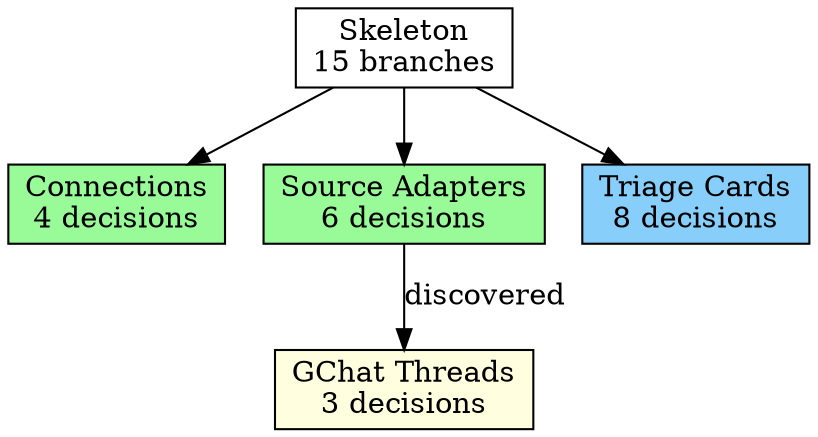

# Deep Plan Skill — Design Spec

## Context

Planning complex features requires exhaustive design exploration — walking every branch of the design tree, challenging assumptions, sharpening language, and producing spec/plan artifacts that survive implementation. The existing `mp-grill-with-docs` skill does this interactively, but requires a human to answer every grilling question. For large plans (30+ design decisions), this is slow and repetitive — the human often gives answers consistent with their established preferences.

The deep-plan skill automates the grilling process. It builds a contextual model of the user's preferences, auto-answers grilling questions where confident, prompts the user only when genuinely uncertain, and produces fully-grilled design artifacts autonomously.

## Goals

1. **Autonomous planning** — the skill runs until the plan is fully explored with high confidence, spawning sub-agents to limit context bloat
2. **Contextual auto-answering** — uses domain-tagged user preferences to answer grilling questions without human input
3. **Exhaustive exploration** — iterative deepening discovers and explores new branches until no uncertain branches remain
4. **Grounded in grill-with-docs** — wraps the existing grilling protocol via a distilled `GRILLER-PROTOCOL.md`, doesn't reinvent it
5. **Observable** — produces a planning report with decision log, branch tree visualization (ASCII + graphviz .dot + rendered PNG), and execution stats
6. **Configurable** — iteration limits, confidence thresholds, domain overrides, redo support

## Architecture

```
/deep-plan <topic or spec-path> [--flags]
     │
     ▼
┌─────────────────────────────────┐
│  Orchestrator (main agent)      │
│                                 │
│  ┌───────────────────────────┐  │
│  │ User Model                │  │
│  │  • Claude Code memory     │  │
│  │  • Workbench APIs (read-only) │
│  │  • CONTEXT.md + ADRs      │  │
│  │  • CLAUDE.md              │  │
│  │  • Explicit directives    │  │
│  │  • Domain-tagged prefs    │  │
│  └───────────────────────────┘  │
│                                 │
│  ┌───────────────────────────┐  │
│  │ Preference Store          │  │
│  │  Now: write memory files  │  │
│  │  Later: write workbench   │  │
│  └───────────────────────────┘  │
│                                 │
│  ┌───────────────────────────┐  │
│  │ State File (on disk)      │  │
│  │  decisions + branches +   │  │
│  │  dependencies + iteration │  │
│  │  Enables --resume, --redo │  │
│  └───────────────────────────┘  │
│                                 │
│  Phase Loop                     │
│  ┌─────────────────────────┐   │
│  │ Phase 0:   Bootstrap    │   │
│  │ Phase 0.5: Idea Clarity │   │
│  │ Phase 1:   Skeleton     │   │
│  │ Phase 2:   Grill+Deepen │──┐│
│  │ Phase 3:   Artifacts    │  ││
│  │ Phase 4:   Verification │  ││
│  └─────────────────────────┘  ││
│                               ││
└───────────────────────────────┘│
     │                           │
     ▼                           │
┌────────────────┐               │
│  Sub-agents    │◄──────────────┘
│                │
│  • Griller     │  runs distilled grill-with-docs protocol
│  • Researcher  │  explores codebase / external docs (env-adaptive tools)
│  • Writer      │  produces spec, ADR, plan
│  • Reviewer    │  grills artifacts against explicit checklists
└────────────────┘
```

## Input Modes

The skill accepts two input modes, detected automatically:

| Input | Detection | Behavior |
|-------|-----------|----------|
| **Topic string** | Args don't resolve to a file on disk | Full flow: Phase 0 → 0.5 (idea clarification) → 1 → 2 → 3 → 4 |
| **Existing spec path** | Args resolve to a `.md` file on disk | Skip Phase 0.5. Treat the spec as the skeleton for Phase 1. Grill its sections, rewrite with decisions applied. |

```
/deep-plan phase2-memory-system                    → start from scratch
/deep-plan docs/specs/phase2-spec.md               → grill existing spec
/deep-plan docs/specs/phase2-spec.md --skip-plan   → grill spec only, no plan
/deep-plan docs/specs/phase2-spec.md --plan-only   → plan from grilled spec
/deep-plan docs/specs/phase2-spec.md --resume      → continue interrupted session
/deep-plan docs/specs/phase2-spec.md --redo "use SQLite instead of PostgreSQL"
```

**`--plan-only` with UNRESOLVED markers:** If the input spec contains `UNRESOLVED:` markers (from a previous max-iterations run), the skill lists them and offers three options: (a) plan around them with `BLOCKED` markers on affected tasks, (b) run grilling first to resolve them, (c) abort.

**File collision handling:** Before writing artifacts, the skill checks for existing files at the target path:
- If a state file exists for the same topic → ask "resume existing session or start fresh?"
- If artifacts exist but no state file (completed session) → ask "overwrite or create a new version?" New versions get a `-v2`, `-v3` suffix.
- No existing files → proceed normally.

## User Model

### Sources (checked in priority order)

1. **Claude Code memory** (`~/.claude/projects/.../memory/`) — feedback memories, project context, user profile. Richest source — captures past corrections and confirmed approaches.
2. **Workbench APIs** (`GET /api/memory/facts`, interaction log) — preference facts from triage history. Read-only for now; supplemental to memory files.
3. **CONTEXT.md + ADRs** — domain glossary and past architectural decisions. Decisions already made should be respected, not re-litigated.
4. **CLAUDE.md** — project-level instructions and constraints.
5. **Explicit directives** — arguments or instructions passed when invoking the skill (e.g., "prefer SOLID principles", "don't delay things").

### Domain-Tagged Preferences

Preferences are contextual, not flat. The same user may prefer deep module design in backend code but simplicity in frontend UI.

**Domain detection:** The orchestrator classifies the planning input into domains using judgment (not a formal classifier): `backend`, `frontend`, `infrastructure`, `data-ml`, `devops`, `api-design`, `observability`, etc. A single plan can span multiple domains. The domain vocabulary is open — the orchestrator can coin new tags when the topic doesn't fit existing ones.

Detected domains are shown in Phase 0 output so the user can correct them. The `--domains` flag overrides auto-detection.

**Inheritance with override:**
- **Base preferences** — apply everywhere unless overridden (e.g., "get the most work done up front")
- **Domain-specific preferences** — override the base for that domain (e.g., backend: "SOLID, deep modules"; frontend: "minimal abstractions, hooks only")

**Discovery through interaction:** When the skill encounters a domain with no stored preferences, it asks 2-3 calibration questions at the start, then saves the answers as domain-tagged memories for future sessions.

**Storage format:**

```markdown
---
name: preference-solid-backend
description: User prefers SOLID principles and deep module design in backend code
metadata:
  type: feedback
  domains: [backend, api-design]
---

Prefer SOLID principles, deep module design, decoupled interfaces in backend code.
**Why:** User explicitly stated this preference in planning session 2026-06-03.
**How to apply:** When designing backend services, providers, storage layers, or API interfaces.
```

### Confidence Thresholds

| Level | Behavior | When |
|-------|----------|------|
| **High** | Auto-answer silently | Memory has a direct match, or CONTEXT.md/ADR already decided this, or codebase clearly shows the pattern |
| **Medium** | Auto-answer with rationale shown | No direct match but consistent with user's stated principles for this domain |
| **Low** | Prompt the user | Genuinely novel trade-off with no signal from any source |

The `--confidence-threshold` flag sets the minimum level to auto-answer without prompting:
- `low` — auto-answer everything, never prompt (fully autonomous)
- `medium` (default) — auto-answer high and medium, prompt on low
- `high` — auto-answer only high, show rationale for medium, prompt on low
- `paranoid` — prompt for everything

**Phase 0.5 override:** During idea clarification, the confidence threshold is always `very-high` regardless of the `--confidence-threshold` flag. Only auto-answer when memory/ADR/CLAUDE.md explicitly covers the question. Getting the "what" wrong wastes everything downstream.

### Preference Store Abstraction

The skill abstracts preference storage so the migration from memory files to workbench is a swap, not a rewrite.

```
PreferenceStore
  ├── read(domain, context) → preferences
  └── write(preference, domain, source)

Now:  read = Claude Code memory files + workbench API (best-effort)
      write = Claude Code memory files only

Later: read = workbench API only
       write = workbench API only
```

The orchestrator writes preferences inline as they're discovered — when the user corrects an auto-answer or confirms a surprising one, the preference is saved immediately. No batching to the end.

## Iterative Deepening Loop

### Phase 0: Bootstrap (main agent)

1. Read all preference sources (memory files, CONTEXT.md, ADRs, CLAUDE.md)
2. Best-effort read from workbench APIs (`GET /api/memory/facts`)
3. Detect domain(s) from the input
4. Load domain-tagged preferences; if a domain has no preferences, ask calibration questions (2-3 max), save answers
5. Compile a compact "user model brief" (~1000 tokens) passed to every sub-agent, structured as:

```
## User Model Brief

### Base Preferences
- [3-5 bullet points from base feedback memories]

### Domain Preferences: {domain}
- [2-3 bullet points per detected domain]

### Active Constraints
- [from CLAUDE.md and relevant ADRs — 3-5 bullet points]

### Correction Patterns
- [from feedback memories — things the user has corrected before]

### Session Directives
- [from explicit args and conversation context]
```

### Phase 0.5: Idea Clarification (topic input only)

Skipped when the input is an existing spec file.

1. Read the topic description
2. If invoked mid-conversation, scan the **last 10 messages** for relevant context about the planning topic (what they want to build, constraints mentioned, approaches discussed). Unrelated messages are ignored — if the last 10 messages don't relate to the topic, treat as a fresh invocation.
3. Identify what's unclear — purpose, constraints, success criteria, scope boundaries, key trade-offs
4. Check the user model for answers (maybe memory already says "this project is single-user, devgpu-deployed, Meta-internal")
4. Auto-answer what it can (only at `very-high` confidence — explicit match in memory/ADR/CLAUDE.md)
5. Prompt for everything else, one question at a time
6. Once confident: propose 2-3 architectural approaches if the design space is open, or proceed to skeleton if the approach is obvious
7. **Exit condition:** the orchestrator can write a one-paragraph summary of what's being built and why, and the user agrees it's accurate

**Scope decomposition:** If the topic describes 4+ independent subsystems with no shared state, the skill suggests decomposition with natural seams. The user picks which sub-project to plan first. The skill plans that one through to completion. The user re-invokes `/deep-plan` for subsequent sub-projects. Separate invocations keep context fresh and let the user re-prioritize between sub-projects.

### Phase 1: Skeleton (main agent)

1. Produce a high-level spec outline — section headings, key decisions to make, scope boundaries
2. If input is an existing spec, extract branches from its sections
3. If invoked mid-conversation, distill conversation context into the topic description and user model brief (don't re-ask questions the conversation already answered)
4. Identify the **branches** — each section or design decision that needs exploration
4. Target **5-15 grilling questions per branch**. Sections with 30+ decisions get split into sub-branches. Sections with 2 decisions stay as single branches.
5. Assign initial confidence to each branch:
   - `known` — ADR/memory already covers it
   - `likely` — can auto-answer from domain-tagged principles
   - `uncertain` — needs a deep-dive sub-agent
6. Do a broad codebase survey (or dispatch a Researcher sub-agent) to produce a **codebase context summary** (~1000 tokens) covering relevant architecture, patterns, and interfaces

### Phase 2: Grill + Deepen (loop)

For each `uncertain` or `likely` branch:

1. **Spawn a Griller sub-agent** scoped to that branch. The sub-agent receives:
   - The branch topic + curated codebase context (relevant file excerpts, not full state)
   - The user model brief (~1000 tokens, structured)
   - CONTEXT.md (full — small file, load-bearing for the grilling protocol)
   - The distilled grill-with-docs protocol (from `GRILLER-PROTOCOL.md`)
   - The response template (from `GRILLER-RESPONSE-TEMPLATE.md`)
   - Auto-answer instructions: "answer questions yourself using the user model. Return questions you can't answer with your recommended answer and confidence level."
   - Any decisions already made as constraints ("these are settled, don't re-decide")

2. Sub-agent **explores the codebase** using curated context provided by the orchestrator. If it needs additional files, it returns those as unresolved items for the orchestrator to fulfill.

3. Sub-agent returns structured results (see Sub-Agent Contract below)

**Orchestrator collects results:**
- Auto-answered with high confidence → accepted, folded into spec
- Auto-answered with medium confidence → shown to user with rationale, batch-confirmed
- Unanswerable questions → prompted to user (batched, with recommendations)
- New branches discovered → added to the queue
- User corrections → saved as domain-tagged preferences immediately
- File read requests → orchestrator reads them (or dispatches Researcher) and feeds back next iteration

**Conflict resolution (three layers):**
1. **Prevention:** When dispatching parallel Grillers, the orchestrator includes all settled decisions as constraints so Grillers don't re-decide them
2. **Detection:** After collecting results, the orchestrator scans for contradictions across Grillers. Conflicting decisions become a new branch in the next iteration.
3. **Sequencing:** When branches share concerns (overlapping types, shared interfaces), the orchestrator runs them sequentially so later Grillers inherit earlier decisions. Truly independent branches run in parallel.

**Parallel dispatch strategy:** First iteration defaults to maximum parallelism (the orchestrator can't reliably predict overlap before grilling). Subsequent iterations use prior-round signals — branches that touched the same types/interfaces in the prior round get sequenced.

**Loop exit:**
- No `uncertain` branches remain AND no sub-agent returned unanswerable questions → proceed to Phase 3
- `--max-iterations` reached → produce partial artifacts with `UNRESOLVED: [question with recommendation]` markers. No implementation plan produced (can't plan unresolved design). Planning report flags unresolved branches. User can re-run `/deep-plan <spec-path>` to continue grilling.

**Small scope fast path:** If the skeleton has ≤3 branches and none are `uncertain`, the orchestrator handles grilling inline — no sub-agents dispatched. Still follows the grill-with-docs protocol, still produces artifacts, just no orchestration overhead. `--dry-run` shows: "skeleton has N branches (all likely). Fast path — no sub-agents needed."

**State file update:** After each iteration, the orchestrator writes current state to disk as a full JSON rewrite (not incremental — avoids corruption). This is the source of truth — if the session crashes or context compresses, the orchestrator re-reads it. See State Management section.

### Phase 3: Artifacts (sub-agents per artifact)

Artifacts are produced in dependency order. Each passes its own grill before the next begins.

1. **CONTEXT.md updates** — applied incrementally during Phase 2 (no separate write step)
2. **Spec** — Writer sub-agent produces the full design spec following `WRITER-SPEC-PROTOCOL.md` (consistent structure: Context, Goals, Architecture, Design sections, File Changes, Verification, Resolved Questions, Out of Scope). A Reviewer sub-agent grills it against `SPEC-REVIEW-CHECKLIST.md`. Fix → re-grill → loop until clean.
3. **ADRs** — only when all three criteria are met (hard to reverse + surprising + real trade-off). Writer sub-agent produces; no separate grill (the underlying decisions were already grilled).
4. **Implementation Plan** — Writer sub-agent follows `WRITER-PLAN-PROTOCOL.md` (distilled writing-plans format: header, file structure, TDD, bite-sized tasks, exact file paths, no placeholders, complete code). Self-review and execution handoff are stripped — the Reviewer handles those. A Reviewer sub-agent grills it against `PLAN-REVIEW-CHECKLIST.md`. Fix → re-grill → loop until clean.

**Commit strategy:** The skill asks once at the start of Phase 3: "I'll commit each artifact separately as it passes review. OK?" If yes, commits without asking again. If no, artifacts are written but not committed. Also controllable via `--auto-commit` flag.

### Phase 4: Final Verification (sub-agent)

A final Reviewer sub-agent does a cross-cutting review against `FINAL-REVIEW-CHECKLIST.md`:
- Spec ↔ plan consistency (every spec requirement maps to a plan task)
- CONTEXT.md updated with all new terms from the session
- No unresolved TODOs or placeholders in any artifact
- All ADR candidates either written or explicitly rejected
- Terms and type names consistent across spec and plan
- ADRs don't contradict the spec

### Exit Condition

All branches resolved + all artifacts pass their grill passes + final verification clean.

## Sub-Agent Contract

### Sub-Agent Types

| Type | Purpose | Model |
|------|---------|-------|
| **Griller** | Deep-dive one branch of the design tree using the distilled grill-with-docs protocol | Opus |
| **Researcher** | Explore codebase or external docs to answer a specific question. Uses whatever search and exploration tools are available in the environment (meta_codesearch, search_files MCP, Read, Bash — no hardcoded tool names). Dispatched as general-purpose agent (not Explore) for full tool access; the prompt constrains to read-only behavior. | Sonnet |
| **Writer** | Produce an artifact (spec, ADR, plan) | Opus |
| **Reviewer** | Grill a completed artifact against an explicit checklist | Opus |

**When to use Researcher vs direct read:** If the orchestrator knows the file path, read it directly. If the question is open-ended exploration ("which files implement the provider pattern?"), spawn a Researcher.

### Every Sub-Agent Receives

1. **Task brief** — what to do, scoped tightly to one branch or artifact
2. **User model brief** — compact summary of domain-tagged preferences (~500 tokens)
3. **Protocol/checklist** — Grillers get `GRILLER-PROTOCOL.md`, Reviewers get their type-specific checklist
4. **Response template** — Grillers get `GRILLER-RESPONSE-TEMPLATE.md` with exact section headers
5. **Relevant context** — curated file excerpts and codebase context, not the full accumulated state
6. **Settled decisions** — any decisions already made that this sub-agent must respect as constraints

The orchestrator never passes the full accumulated state. It curates a focused briefing per sub-agent. This is the key to avoiding context bloat.

### Every Sub-Agent Returns

The sub-agent structures its response with these exact headers (from the response template):

```
### Decisions
- [Question]: [Answer] | Confidence: high/medium/low | Source: [memory/ADR/codebase/principle]

### Unresolved
- [Question]: Recommended: [answer] | Confidence: low | Why uncertain: [reason]

### ADR Candidates
(only if all three criteria met: hard to reverse + surprising + real trade-off)
- Title: [title] | Context: [context] | Decision: [decision] | Alternatives: [list]

### CONTEXT.md Updates
- **Term**: definition. _Avoid_: [synonyms]

### New Branches
- [Topic] — [why this needs its own deep-dive]
```

The orchestrator reads this holistically (not brittle parsing). The template ensures consistent structure.

### Sub-Agent Failure Handling

- **Returns garbage** (no recognizable sections) → log warning, treat all questions as unresolved, re-queue the branch
- **Times out** → same as garbage
- **Returns partial results** (some sections present, some missing) → accept what's there, treat missing as unresolved
- **Repeated failures** (same branch fails 2+ times) → mark branch as `failed` in state file, surface in planning report, continue with other branches

## State Management

The orchestrator maintains state **on disk** at `docs/deep-plan/reports/YYYY-MM-DD-<topic>-state.json`, not just in conversation context. This is the single source of truth.

**Written after each iteration. Contains:**

```json
{
  "topic": "phase2-memory-system",
  "domains": ["backend", "api-design"],
  "iteration": 3,
  "phase": "grill-deepen",
  "branches": [
    {
      "id": "branch-001",
      "topic": "Connection pooling",
      "confidence": "known",
      "depth": 1,
      "parent": null,
      "status": "resolved"
    },
    {
      "id": "branch-002",
      "topic": "GChat thread model",
      "confidence": "uncertain",
      "depth": 2,
      "parent": "branch-005",
      "status": "resolved"
    }
  ],
  "decisions": [
    {
      "id": "dec-001",
      "question": "Canonical ID format",
      "answer": "UUID4",
      "confidence": "high",
      "source": "ADR 0009 + memory",
      "domain": "backend",
      "branch": "branch-003",
      "depends_on": [],
      "status": "resolved"
    },
    {
      "id": "dec-002",
      "question": "Entity ref serialization",
      "answer": "List of dicts",
      "confidence": "high",
      "source": "Auto: JSON round-trip safety",
      "domain": "backend",
      "branch": "branch-004",
      "depends_on": ["dec-001"],
      "status": "resolved"
    }
  ],
  "unresolved": [],
  "preference_updates": [],
  "artifacts": {
    "context_md": "updated",
    "spec": "not_started",
    "adrs": [],
    "plan": "not_started"
  }
}
```

**Key fields for --redo support:**
- `decisions[].branch` — which branch produced the decision
- `decisions[].depends_on` — list of decision IDs this decision assumed as constraints. Inferred by the orchestrator (not declared by the Griller): when a Griller receives settled decisions as constraints, the orchestrator knows which IDs were passed. If the Griller's answer references a constraint, the orchestrator records the dependency via fuzzy matching. A wrong link just means an extra branch gets re-grilled on `--redo` (safe, slightly wasteful).

**Benefits:**
- Survives context compaction — orchestrator re-reads the file
- Enables `--resume` — pick up where the session left off
- Enables `--redo` — invalidate specific decisions and re-grill affected branches
- Becomes the data source for the planning report

**Always kept** alongside the report. Required for `--redo` and `--resume` (both need the decision log and branch tree). The planning report is the human-readable view; the state file is the machine-readable source of truth.

## Redo Support

`--redo` allows changing a fundamental decision and re-grilling only the affected branches.

**Invocation:**
```
/deep-plan docs/deep-plan/specs/topic-design.md --redo "use SQLite instead of PostgreSQL"
```

**Flow:**

1. Load the state file for that spec
2. Find decisions that match or are affected by the redo directive (orchestrator uses judgment — "use SQLite" affects any decision that referenced PostgreSQL)
3. Mark affected decisions as `invalidated`
4. Walk the branch tree using `depends_on` links — any branch that produced an invalidated decision, plus any branch that consumed an invalidated decision as a constraint, gets re-queued as `uncertain`
5. Run Phase 2 (Grill + Deepen) with the new constraint injected into every Griller's brief
6. Re-generate affected artifacts (spec sections, plan tasks)
7. Run Phase 4 (Final Verification) on the updated artifacts

**Cascade detection:** If >60% of decisions are invalidated by the redo, the skill suggests starting from scratch instead of selective re-grilling.

## Reviewer Checklists

Each Reviewer type gets an explicit checklist pasted into its prompt.

### Spec Reviewer (`SPEC-REVIEW-CHECKLIST.md`)

- Every resolved decision from the grilling sessions is reflected in the spec
- No internal contradictions between sections
- No fuzzy language that was supposed to be sharpened (cross-reference CONTEXT.md)
- Scope matches what was agreed — no creep, no missing pieces
- Terms match CONTEXT.md exactly
- No placeholders, TBDs, or "to be determined"

### Plan Reviewer (`PLAN-REVIEW-CHECKLIST.md`)

- Every spec requirement maps to at least one task (coverage)
- No placeholders or "similar to Task N"
- Type/method/function names consistent across tasks
- Task ordering respects dependencies
- Code in later tasks matches interfaces defined in earlier tasks
- Test commands are exact and runnable

### Final Reviewer (`FINAL-REVIEW-CHECKLIST.md`)

- Spec ↔ plan consistency (every spec requirement maps to a plan task)
- CONTEXT.md has all terms introduced during grilling
- ADRs don't contradict the spec
- No artifact references a concept not defined in another artifact
- No unresolved TODOs or placeholders in any artifact

## User Prompting

### When the Skill Prompts

1. **Domain calibration** (Phase 0) — first time encountering a domain with no stored preferences. 2-3 questions max, batched.
2. **Idea clarification** (Phase 0.5) — questions about the idea itself until the orchestrator is confident it understands. One at a time.
3. **Unanswerable grilling questions** — batched after each grilling round, presented with recommended answers.
4. **Conflicting signals** — memory says one thing, codebase shows another. Surfaces the conflict.
5. **Scope decisions** — plan is large enough to split into sub-projects. Asks about seams.

### Prompt Format

Always batched (except Phase 0.5), always with recommendations:

```
I have 4 questions I couldn't resolve from your preferences:

1. [Connection pooling strategy] I'd pick: shared pool per connection
   type, configurable max size. Reasoning: matches the existing
   asyncpg pool pattern in storage/. Agree?

2. [Error recovery for OAuth token refresh] I'd pick: retry 3x with
   backoff, then mark connection unhealthy. Reasoning: consistent with
   the adapter error isolation pattern. Agree?

3. [Calendar event dedup] Genuinely uncertain — two reasonable approaches:
   a) Hash meaningful fields (title, time, location)
   b) Use Google's event etag
   Which do you prefer?

4. ...
```

### Channel

Terminal only (v1). The user is in Claude Code when the skill runs. Future versions may add GChat notifications for background execution.

### No Timeout

The skill does not implement a timeout. When it needs user input, the session pauses until the user responds (standard Claude Code behavior). Users who want fully autonomous operation set `--confidence-threshold low` to auto-answer everything.

## Configuration

Invoked as: `/deep-plan <topic or spec-path> [--flags]`

| Argument | Default | Description |
|----------|---------|-------------|
| `--max-iterations` | `5` | Maximum grill-deepen cycles before forcing convergence |
| `--max-depth` | `3` | Maximum levels of branch nesting (prevents infinite rabbit holes) |
| `--confidence-threshold` | `medium` | Minimum confidence to auto-answer. `low` = fully autonomous, `medium` = prompt on low, `high` = prompt on low + show rationale for medium, `paranoid` = prompt for everything. Phase 0.5 always uses `very-high` regardless. |
| `--domains` | auto-detected | Override domain detection. E.g., `--domains backend,infra` |
| `--skip-plan` | `false` | Stop after spec + ADRs, don't produce implementation plan |
| `--plan-only` | `false` | Skip grilling, go straight to plan writing from existing spec. Requires spec file input. |
| `--dry-run` | `false` | Show the skeleton and detected branches, don't start grilling |
| `--auto-commit` | `false` | Commit each artifact automatically after it passes review. When false, the skill asks once at the start of Phase 3. |
| `--resume` | `false` | Resume an interrupted session from the state file. If a state file exists for the spec, loads it and continues from where it left off. |
| `--redo` | none | Change a decision and re-grill affected branches. Value is the new constraint (e.g., `--redo "use SQLite instead of PostgreSQL"`) |

**Phase matrix by flag combination:**

| Flag | Phases run | Artifacts produced |
|------|-----------|-------------------|
| (none) | 0 → 0.5 → 1 → 2 → 3 → 4 | CONTEXT.md, spec, ADRs, plan |
| `--skip-plan` | 0 → 0.5 → 1 → 2 → 3 (no plan) → 4 | CONTEXT.md, spec, ADRs |
| `--plan-only` | 0 → 3 (plan only) → 4 | plan |
| `--dry-run` | 0 → 0.5 → 1 | nothing (shows skeleton + branches) |
| `--resume` | load state → continue from interrupted phase | remaining artifacts |
| `--redo` | load state → 2 → 3 → 4 | updated artifacts for affected branches |

`--plan-only` requires a spec file as input. Error if given a topic string.

Args are parsed from the raw string by the orchestrator (Claude reading text, not a formal parser). Unrecognized flags are ignored.

## Observability

### Live Progress

One-line updates at key moments during execution:

```
[deep-plan] Phase 0: loaded 5 memories, 3 ADRs, detected domains: backend, frontend
[deep-plan] Phase 0.5: idea clarification — 3 questions answered, 1 asked
[deep-plan] Phase 1: skeleton has 15 branches (3 known, 8 likely, 4 uncertain)
[deep-plan] Phase 2/iter 1: spawning 4 grillers for uncertain branches
[deep-plan] Griller "connections" done: 4 decisions auto-answered
[deep-plan] Griller "triage cards" done: 6 auto-answered, 2 need user input
[deep-plan] Conflict detected: entity_refs format — spawning resolution griller
[deep-plan] Waiting for user on 3 questions...
[deep-plan] Phase 2/iter 2: 2 new branches discovered, spawning grillers
[deep-plan] State saved to docs/deep-plan/reports/2026-06-03-topic-state.json
[deep-plan] Phase 3: writing spec...
[deep-plan] Spec reviewer found 1 issue, fixing...
[deep-plan] Phase 3: writing plan...
[deep-plan] Phase 4: final verification clean
[deep-plan] All artifacts pass. Done.
```

### Planning Report

Committed to `docs/deep-plan/reports/YYYY-MM-DD-<topic>-report.md` at the end of execution:

```markdown
# Planning Report: <topic>

## Execution Stats
- Duration: 47 minutes
- Sub-agents spawned: 12 (8 grillers, 2 writers, 2 reviewers)
- Grilling iterations: 3
- Questions auto-answered: 34
- Questions asked to user: 6
- Branches explored: 15
- Max depth reached: 2
- Conflicts detected: 1 (resolved in iteration 2)

## Decision Log
| # | Question | Answer | Confidence | Source | Domain | Branch |
|---|----------|--------|------------|--------|--------|--------|
| 1 | Canonical ID format | UUID4 | high | ADR 0009 + memory | backend | identity-resolution |
| 2 | Entity ref serialization | List of dicts | high | Auto: JSON round-trip | backend | enrichment |
| 3 | React state management | Hooks only | medium | Auto: user preference | frontend | react-ui |
| ... | | | | | | |

## Branch Tree

Skeleton (15 branches)
├── Connections (4 decisions) [auto-answered]
├── Source Adapters (6 decisions) [auto-answered]
│   └── GChat Threads (3 decisions) [discovered, auto-answered]
├── Triage Cards (8 decisions) [user input needed]
│   └── Free-text Responses (4 decisions) [discovered, user input]
├── Identity Resolution (5 decisions) [auto-answered]
│   └── Entity Ref Format (2 decisions) [discovered, auto-answered]
└── Action Items (3 decisions) [from ADR/memory]

(see .dot file for full graphviz source)

## Preference Updates
- Saved 3 new domain-tagged preferences
- Updated 1 existing preference

## Artifacts Produced
- CONTEXT.md — 4 terms added, 2 updated
- docs/deep-plan/specs/2026-06-03-<topic>-design.md
- docs/adr/0012-<slug>.md
- docs/deep-plan/plans/2026-06-03-<topic>.md
```

### Visual Branch Tree

Three formats produced:

1. **ASCII tree** in the planning report (immediately readable, no tooling needed)

2. **Graphviz `.dot` file** at `docs/deep-plan/reports/YYYY-MM-DD-<topic>-tree.dot`:



3. **Rendered PNG** at `docs/deep-plan/reports/YYYY-MM-DD-<topic>-tree.png` — best-effort via `dot -Tpng`. Skipped if `graphviz` is not installed (no error, just a note in the report).

## Skill File Layout

```
~/.claude/skills/deep-plan/
  SKILL.md                          # Skill definition (frontmatter + instructions)
  GRILLER-PROTOCOL.md               # Distilled grill-with-docs protocol (~30 lines)
  GRILLER-RESPONSE-TEMPLATE.md      # Response format for Griller sub-agents
  WRITER-SPEC-PROTOCOL.md           # Spec document structure template
  WRITER-PLAN-PROTOCOL.md           # Distilled writing-plans format rules
  SPEC-REVIEW-CHECKLIST.md          # Checklist for spec Reviewer
  PLAN-REVIEW-CHECKLIST.md          # Checklist for plan Reviewer
  FINAL-REVIEW-CHECKLIST.md         # Checklist for final cross-cutting Reviewer
```

**Loading strategy:** Only SKILL.md loads into the orchestrator's context at invocation. Supporting files are read on-demand when dispatching specific sub-agent types (e.g., read `GRILLER-PROTOCOL.md` when dispatching a Griller). SKILL.md does **not** use `@` references to force-load supporting files.

## Output File Layout

```
docs/deep-plan/
  specs/                            # Design specs produced by deep-plan
    YYYY-MM-DD-<topic>-design.md
  plans/                            # Implementation plans
    YYYY-MM-DD-<topic>.md
  reports/                          # Planning reports + branch trees + state
    YYYY-MM-DD-<topic>-report.md
    YYYY-MM-DD-<topic>-tree.dot
    YYYY-MM-DD-<topic>-tree.png     # best-effort, if graphviz available
    YYYY-MM-DD-<topic>-state.json   # always kept, enables --redo and --resume

docs/adr/                           # ADRs (shared with rest of project)
  NNNN-<slug>.md
```

## Relationship to Existing Skills

| Skill | Relationship |
|-------|-------------|
| `mp-grill-with-docs` | **Wrapped** — each Griller sub-agent runs the distilled grill-with-docs protocol from `GRILLER-PROTOCOL.md`. Deep-plan adds the auto-answer layer and orchestration. |
| `brainstorming` | **Replaced for planning** — deep-plan subsumes the brainstorming → spec flow for multi-step features (Phase 0.5 covers idea clarification, approach selection). Brainstorming is still useful for quick idea exploration. |
| `writing-plans` | **Delegated to** — the Writer sub-agent for implementation plans follows writing-plans protocol. |
| `subagent-driven-development` | **Downstream consumer** — after deep-plan produces a plan, subagent-driven-development can execute it. |
| `dispatching-parallel-agents` | **Used internally** — deep-plan spawns parallel Griller sub-agents for independent branches. |

## Resolved Questions (from Grilling Session 2026-06-03)

1. **How Grillers run grill-with-docs:** Distilled protocol pasted into prompt via `GRILLER-PROTOCOL.md` (~30 lines). Not the full SKILL.md (which has Meta-specific exploration instructions).
2. **How orchestrator parses sub-agent responses:** Response template with explicit section headers. Orchestrator reads holistically, not brittle parsing.
3. **Timeout mechanism:** Dropped. Folded into `--confidence-threshold low` (fully autonomous). Session pauses when prompting (standard behavior).
4. **Contradictory parallel decisions:** Prevention (settled decisions as constraints) + detection (post-collection consistency scan) + sequencing (overlapping branches run sequentially).
5. **Domain detection:** Claude's judgment, not a formal classifier. User override via `--domains`. Open vocabulary — new tags coined as needed.
6. **State tracking across iterations:** On-disk state file. Source of truth across context compression and session interruption.
7. **Reviewer checklists:** Explicit per-type checklists: `SPEC-REVIEW-CHECKLIST.md`, `PLAN-REVIEW-CHECKLIST.md`, `FINAL-REVIEW-CHECKLIST.md`.
8. **Scope decomposition:** Suggest split at 4+ independent subsystems. Plan first sub-project. User re-invokes for rest.
9. **Griller codebase exploration:** Orchestrator curates context. Grillers get excerpts. Researchers for open-ended search.
10. **Researcher tool access:** Environment-adaptive — use whatever search/exploration tools are available. No hardcoded tool names.
11. **Existing spec as input:** If args resolve to a file on disk, treat as skeleton for Phase 1. Skip Phase 0.5.
12. **Max-iterations with uncertain branches:** Partial artifacts with `UNRESOLVED` markers. No plan produced. User re-runs to continue.
13. **When to spawn Researcher vs read directly:** Known path → read directly. Open-ended search → Researcher sub-agent.
14. **Branch granularity:** Target 5-15 questions per branch. Split if too large. `--max-depth` caps nesting.
15. **Branch tree rendering:** .dot file + rendered PNG (best-effort) + ASCII tree in report.
16. **Idea clarification before planning:** Phase 0.5 added. Questions until confident, approach selection. Only for new topics.
17. **Auto-answering in Phase 0.5:** Always `very-high` confidence, regardless of `--confidence-threshold`.
18. **Selective redo:** `--redo` in v1. Invalidate affected decisions via `depends_on` links, re-grill affected branches. Cascade detection at 60%.
19. **Sub-agent failure handling:** Re-queue on failure. Mark `failed` after 2+ failures. Don't block session.

## Resolved Questions (from Grilling Session 2026-06-03 — Round 2)

20. **User model brief structure:** Explicit 5-section template (Base Preferences, Domain Preferences, Active Constraints, Correction Patterns, Session Directives). Bumped to ~1000 tokens.
21. **State file format:** JSON, full rewrite each iteration (not incremental edits). Even a 50-decision plan is ~5KB — full generation avoids corruption.
22. **Grillers and CONTEXT.md:** Include CONTEXT.md in every Griller's context. Small file, load-bearing for the grilling protocol's "challenge against the glossary" step.
23. **Detecting branch overlap:** Default parallel in first iteration (can't predict overlap). Use prior-round signals to sequence overlapping branches in subsequent iterations.
24. **Small scope fast path:** ≤3 branches, none uncertain → orchestrator handles inline, no sub-agents. Follows protocol, produces artifacts, just no orchestration overhead.
25. **`--plan-only` flag:** Added. Skips grilling, goes straight to plan writing from existing spec. Requires spec file input.
26. **Writer plan protocol:** Distilled writing-plans format rules in `WRITER-PLAN-PROTOCOL.md`. Self-review and execution handoff stripped (Reviewer handles those).
27. **Writer spec protocol:** `WRITER-SPEC-PROTOCOL.md` defining consistent spec structure (Context, Goals, Architecture, Design sections, File Changes, Verification, Resolved Questions, Out of Scope).
28. **`depends_on` population:** Orchestrator infers from which constraints were passed to the Griller. Fuzzy matching by Claude — a wrong link just means an extra branch gets re-grilled (safe).
29. **Commit strategy:** Skill asks once at start of Phase 3 ("commit each artifact? OK?"). Also `--auto-commit` flag for fully autonomous runs.
30. **Mid-conversation invocation:** Orchestrator reads conversation context as implicit input. Phase 0.5 checks existing context before re-asking questions. Sub-agents get distilled context, not raw conversation.

## Resolved Questions (from Grilling Session 2026-06-03 — Round 3)

31. **Empty preference store with `--confidence-threshold low`:** Let it run. Produces best-judgment plan, transparent about assumptions (`source: "no signal, best judgment"`). Corrections become first preferences.
32. **State file retention:** Always kept (not deleted on completion). Required for `--redo` and `--resume`. Small file (~5KB), lives alongside the report.
33. **`--plan-only` on spec with UNRESOLVED markers:** Check for markers, offer three options: (a) plan with BLOCKED tasks, (b) resolve first, (c) abort.
34. **Mid-conversation context scope:** Scan last 10 messages for relevant context. Unrelated messages ignored — treated as fresh invocation.
35. **8 supporting files — context bloat:** No risk. Only SKILL.md loads initially. Protocol files read on-demand per sub-agent type. No `@` force-loading.
36. **`--redo` cascade with overlapping dependencies:** Works as-is. Re-grill whole branch from scratch with updated constraints. Redundant calls acceptable for correctness.
37. **Researcher sub-agent type:** General-purpose agent (not Explore). Full tool access; prompt constrains to read-only behavior.
38. **`--resume` moved to v1:** Subset of `--redo` implementation (load state, continue without invalidation). Inconsistent to exclude when `--redo` is in scope.
39. **Same topic planned twice:** Check for existing files. State file exists → offer resume. Completed artifacts exist → offer overwrite or version suffix (`-v2`).

## Verification

The deep-plan skill is working correctly when:

1. Domain detection correctly identifies the planning domain(s) from the input
2. Domain-tagged preferences are loaded and used to auto-answer questions
3. Calibration questions are asked for unknown domains, and answers are saved
4. The distilled grill-with-docs protocol is followed by every Griller sub-agent (challenge glossary, sharpen language, ADR criteria)
5. Auto-answered questions have correct confidence levels — high-confidence answers match memory/ADRs, medium-confidence answers are consistent with principles
6. Unanswerable questions are batched and presented with recommendations
7. User corrections are saved as domain-tagged preferences immediately
8. The iterative deepening loop discovers and explores new branches
9. The loop converges (branches decrease each iteration, or max-iterations is hit)
10. Max-iterations produces partial artifacts with explicit `UNRESOLVED` markers (not forced assumptions)
11. CONTEXT.md is updated incrementally with new terms
12. The spec passes a Reviewer grill against `SPEC-REVIEW-CHECKLIST.md` (no contradictions, gaps, or fuzzy language)
13. ADRs are written only when all three criteria are met
14. The implementation plan follows writing-plans protocol (TDD, exact paths, no placeholders)
15. The plan passes a Reviewer grill against `PLAN-REVIEW-CHECKLIST.md` (spec coverage, type consistency)
16. Final cross-cutting verification catches spec↔plan inconsistencies
17. Each artifact is committed separately
18. State file written after each iteration; survives context compression
19. `--redo` correctly invalidates affected decisions, re-grills affected branches, detects cascades
20. Existing spec input mode treats the file as skeleton, skips Phase 0.5
21. Phase 0.5 uses `very-high` confidence threshold regardless of flag
22. Parallel Grillers pass settled decisions as constraints; conflicts detected and re-grilled
23. Researcher sub-agents use environment-adaptive tools (no hardcoded tool names)
24. Sub-agent failures are re-queued; repeated failures marked and surfaced without blocking
25. The planning report accurately reflects what happened (decision log, branch tree, stats)
26. The graphviz branch tree shows exploration path with color-coded resolution sources
27. ASCII tree in report is immediately readable without tooling
28. PNG rendering is best-effort (skipped if graphviz unavailable)
29. `--dry-run` shows skeleton and branches without starting grilling
30. `--confidence-threshold low` runs fully autonomously without prompting
31. `--confidence-threshold paranoid` prompts the user for everything
32. Scope decomposition suggested at 4+ independent subsystems; plans one at a time
33. User model brief is ~1000 tokens with 5 explicit sections
34. CONTEXT.md included in every Griller's context
35. First iteration dispatches Grillers in parallel; subsequent iterations sequence overlapping branches
36. Small scope (≤3 branches, none uncertain) uses inline fast path with no sub-agents
37. `--plan-only` skips grilling and produces plan from existing spec; errors on topic string input
38. Writer spec follows `WRITER-SPEC-PROTOCOL.md`; Writer plan follows `WRITER-PLAN-PROTOCOL.md`
39. `depends_on` inferred by orchestrator from constraints passed, not declared by Griller
40. `--auto-commit` commits artifacts without asking; default behavior asks once at Phase 3 start
41. Mid-conversation context used as implicit input; Phase 0.5 doesn't re-ask answered questions
42. State file always kept (not deleted on completion); enables `--redo` and `--resume`
43. `--resume` loads state file and continues from interrupted phase
44. `--plan-only` checks for UNRESOLVED markers and offers plan-around/resolve/abort options
45. Conversation context scoped to last 10 messages; unrelated messages ignored
46. Supporting files read on-demand, not force-loaded via `@` references
47. Researcher dispatched as general-purpose agent with full tool access
48. File collision detection: offer resume (if state exists) or version suffix (if completed artifacts exist)

## Out of Scope

- Workbench API writes (deferred until workbench preference storage is built)
- GChat-based prompting (terminal only for v1; GChat is a future enhancement)
- Automatic execution of the produced plan (that's subagent-driven-development's job)
- Multi-project planning (plan one feature at a time; the skill suggests decomposition if the input is too large)
- Real-time collaboration (single user, single session)
- Automatic preference migration from Claude Code memory to workbench API (manual sync until workbench preference storage is built)
